# Backend Architecture

## 1. Backend Mission

The backend is the enterprise control plane for AI Azure Well-Architected Review Assistant. It manages tenants, identity, projects, architecture evidence, knowledge ingestion, AI review execution, chat consultation, reporting, auditability, and integration with Azure-native services.

The service must behave like a secure SaaS platform, not a demo API. Every backend path must enforce tenant isolation, object authorization, auditability, observability, idempotency where relevant, and resilient integration with Azure OpenAI, Azure AI Search, Azure Blob Storage, PostgreSQL, Redis, and Azure Service Bus.

## 2. Backend Runtime Topology

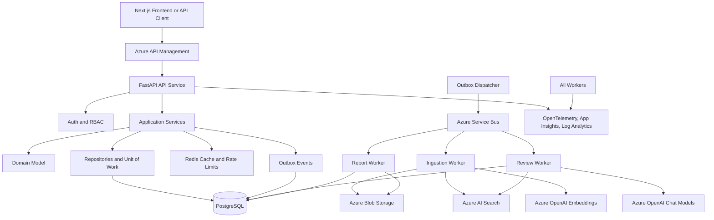

### Runtime Components

| Component | Runtime | Responsibility |
| --- | --- | --- |
| `api` | FastAPI app | Synchronous REST API, auth, orchestration entry points, dashboard data, chat streaming. |
| `ingestion-worker` | Async worker | Document extraction, normalization, chunking, embedding, search indexing. |
| `review-worker` | Async worker | Pillar analysis, finding generation, scoring, synthesis, model-output validation. |
| `report-worker` | Async worker | PDF generation, evidence pack creation, report storage. |
| `outbox-dispatcher` | Background worker | Reliable publication of committed domain events to Service Bus. |
| `scheduler` | Background worker | Retention jobs, stale job recovery, search index health checks, usage rollups. |

## 3. Architectural Style

The backend uses clean architecture with strict dependency direction.

```text
api/routes -> application -> domain
application -> infrastructure ports
infrastructure -> external systems
```

### Layer Rules

| Layer | Can Depend On | Cannot Depend On |
| --- | --- | --- |
| API | Application, core, schemas | SQLAlchemy models directly, Azure SDKs directly, prompt files directly. |
| Application | Domain, ports, schemas | FastAPI request objects, Azure SDK concrete clients. |
| Domain | Standard library, domain value objects | Database, FastAPI, Azure SDKs, Redis, Service Bus. |
| Infrastructure | Domain ports, SDKs, persistence models | Route handlers, UI contracts. |
| Workers | Application commands, infrastructure bootstrap | Route-only dependencies. |

### Key Patterns

- Command/query separation for write and read use cases.
- Unit of Work for transactional writes.
- Repository interfaces for aggregate persistence.
- Outbox pattern for reliable async job dispatch.
- Provider adapters for Azure OpenAI, Azure AI Search, Blob Storage, Service Bus, Document Intelligence.
- Policy services for RBAC, tenant isolation, data classification, token budgets, and model routing.
- Schema validation for all model-generated review outputs.

## 4. Backend Folder Structure

```text
backend/
  pyproject.toml
  alembic.ini
  app/
    main.py
    api/
      dependencies.py
      middleware.py
      pagination.py
      responses.py
      websocket.py
      v1/
        auth.py
        tenants.py
        users.py
        projects.py
        architectures.py
        uploads.py
        knowledge.py
        reviews.py
        findings.py
        chat.py
        reports.py
        admin.py
        health.py
    core/
      config.py
      constants.py
      exceptions.py
      logging.py
      telemetry.py
      security.py
      crypto.py
      rate_limits.py
      idempotency.py
      clock.py
      feature_flags.py
    domain/
      common/
        entity.py
        value_objects.py
        events.py
        enums.py
      identity/
        models.py
        policies.py
        events.py
      tenants/
        models.py
        policies.py
        events.py
      projects/
        models.py
        policies.py
        events.py
      architectures/
        models.py
        graph.py
        policies.py
        events.py
      knowledge/
        models.py
        chunking_rules.py
        policies.py
        events.py
      reviews/
        models.py
        scoring.py
        policies.py
        events.py
      chat/
        models.py
        policies.py
        events.py
      reports/
        models.py
        policies.py
        events.py
      audit/
        models.py
        events.py
    application/
      ports/
        auth_provider.py
        blob_store.py
        vector_search.py
        embedding_model.py
        chat_model.py
        document_extractor.py
        message_bus.py
        pdf_renderer.py
        malware_scanner.py
      commands/
        tenants.py
        users.py
        projects.py
        architectures.py
        uploads.py
        knowledge.py
        reviews.py
        findings.py
        chat.py
        reports.py
      queries/
        tenants.py
        users.py
        projects.py
        architectures.py
        reviews.py
        findings.py
        chat.py
        reports.py
        admin.py
      services/
        authorization_service.py
        tenant_context_service.py
        upload_service.py
        ingestion_service.py
        retrieval_service.py
        review_orchestrator.py
        chat_orchestrator.py
        report_service.py
        audit_service.py
        usage_service.py
        notification_service.py
      workflows/
        ingestion_workflow.py
        review_workflow.py
        report_workflow.py
      dto/
        common.py
        reviews.py
        findings.py
        chat.py
        reports.py
    infrastructure/
      db/
        base.py
        session.py
        unit_of_work.py
        models/
        repositories/
        migrations/
      azure_openai/
        chat_client.py
        embedding_client.py
        model_router.py
        token_budget.py
      azure_search/
        index_client.py
        query_client.py
        schemas.py
        index_lifecycle.py
      blob_storage/
        client.py
        paths.py
        sas.py
      service_bus/
        publisher.py
        consumers.py
        messages.py
      document_intelligence/
        extractor.py
      redis/
        cache.py
        rate_limiter.py
        idempotency_store.py
      pdf/
        renderer.py
        templates.py
      security/
        jwt_validator.py
        entra.py
        malware.py
        redaction.py
      telemetry/
        exporters.py
        meters.py
    rag/
      chunking/
        splitter.py
        hierarchy.py
        metadata.py
      retrieval/
        query_planner.py
        filters.py
        hybrid_retriever.py
        reranker.py
        evidence_pack.py
      citations/
        citation_builder.py
        citation_validator.py
      evaluation/
        datasets.py
        metrics.py
        evaluators.py
    review_engine/
      schemas/
        finding_schema.py
        pillar_schema.py
        report_schema.py
      analyzers/
        security.py
        reliability.py
        performance_efficiency.py
        cost_optimization.py
        operational_excellence.py
      scoring/
        severity.py
        maturity.py
        score_calculator.py
      synthesis/
        roadmap.py
        tradeoffs.py
        modernization.py
      validators/
        output_validator.py
        evidence_validator.py
        safety_validator.py
      prompts/
        registry.py
        renderer.py
    workers/
      bootstrap.py
      ingestion_worker.py
      review_worker.py
      report_worker.py
      outbox_dispatcher.py
      scheduler.py
    tests/
      unit/
      integration/
      contract/
      security/
      ai_evals/
```

## 5. Service and Module Responsibilities

### API Module

The API module owns transport concerns only.

| Module | Responsibility |
| --- | --- |
| `api/middleware.py` | Correlation IDs, request logging, security headers, exception mapping, body-size guardrails. |
| `api/dependencies.py` | Current user, tenant context, DB session, authorization dependencies, idempotency dependencies. |
| `api/v1/*` | Thin route handlers that validate request bodies and call application commands or queries. |
| `api/responses.py` | Standard response envelopes, error models, pagination metadata. |
| `api/websocket.py` | Optional streaming transport for chat status, review progress, and report progress. |

Route handlers should not contain business logic. A route should do four things: authenticate, authorize, validate, dispatch.

### Core Module

The core module contains cross-cutting primitives.

| Module | Responsibility |
| --- | --- |
| `config.py` | Typed settings loaded from environment, Azure App Configuration, and Key Vault references. |
| `security.py` | Passwordless auth helpers, token parsing, permission constants, secure comparison. |
| `exceptions.py` | Domain, application, authorization, conflict, validation, dependency, and rate-limit exceptions. |
| `logging.py` | JSON logs, correlation IDs, redaction filters, audit-safe formatting. |
| `telemetry.py` | OpenTelemetry trace, metric, and baggage helpers. |
| `rate_limits.py` | Rate-limit policies by tenant, user, route, and operation type. |
| `idempotency.py` | Idempotency key validation and replay behavior. |
| `feature_flags.py` | Runtime feature gates for preview capabilities such as diagram analysis. |

### Domain Module

The domain module owns business rules.

| Domain | Aggregates | Invariants |
| --- | --- | --- |
| Identity | User, Role, Membership | User role assignments must be tenant-scoped; disabled users cannot create review runs. |
| Tenants | Tenant, TenantSettings | Data region and isolation mode cannot be changed without migration workflow. |
| Projects | Project | Project access requires tenant membership and project role or tenant admin. |
| Architectures | Architecture, ArchitectureVersion, Component, Relationship | Review runs must target immutable architecture versions. |
| Knowledge | Source, Document, Chunk, IngestionJob | Chunks belong to a document version and preserve citation metadata. |
| Reviews | Review, ReviewRun, PillarScore, Finding, ImprovementItem | Findings are immutable per AI run; reviewer edits create annotations or state transitions. |
| Chat | ChatSession, ChatMessage | Chat context must be tenant- and project-scoped. |
| Reports | Report | Reports are generated from approved or explicitly draft review state. |
| Audit | AuditLog | Audit entries are append-only. |

### Application Services

Application services coordinate use cases.

| Service | Responsibility |
| --- | --- |
| `AuthorizationService` | Central authorization decisions for tenant, project, review, finding, report, and admin resources. |
| `TenantContextService` | Resolves tenant context from JWT claims, host, route, and project ownership. |
| `UploadService` | Creates upload sessions, validates file metadata, issues SAS URLs, completes uploads. |
| `IngestionService` | Starts ingestion jobs, tracks state, handles retries, publishes ingestion events. |
| `RetrievalService` | Builds query plans, applies filters, retrieves evidence, validates citations. |
| `ReviewOrchestrator` | Runs pillar analyzers, aggregates findings, scores maturity, produces roadmap. |
| `ChatOrchestrator` | Handles grounded chat turns, retrieval, tool calls, response streaming, citation storage. |
| `ReportService` | Generates report jobs, assembles report models, renders PDF, stores artifacts. |
| `AuditService` | Writes audit records for security-sensitive operations. |
| `UsageService` | Tracks token usage, cost estimates, quotas, model latency, and tenant consumption. |

### Infrastructure Adapters

| Adapter | External Dependency | Contract |
| --- | --- | --- |
| `AzureOpenAIChatClient` | Azure OpenAI chat deployments | Structured model calls, streaming, retries, content-filter handling. |
| `AzureOpenAIEmbeddingClient` | Azure OpenAI embedding deployments | Batch embeddings, token limits, backoff, partial failure handling. |
| `AzureSearchQueryClient` | Azure AI Search | Hybrid search, semantic ranking, metadata filters, index aliasing. |
| `AzureSearchIndexClient` | Azure AI Search | Index creation, blue/green index migration, schema validation. |
| `BlobStoreClient` | Azure Blob Storage | Upload/download, metadata, lifecycle paths, legal hold hooks. |
| `ServiceBusPublisher` | Azure Service Bus | Durable message publish with message IDs and correlation IDs. |
| `DocumentExtractor` | Azure AI Document Intelligence plus parsers | Text, table, page, and layout extraction. |
| `RedisRateLimiter` | Azure Cache for Redis | Sliding-window and token-bucket rate limiting. |
| `PdfRenderer` | Isolated rendering container/library | HTML-to-PDF rendering, watermarking, table of contents. |
| `JwtValidator` | Microsoft Entra ID | JWKS caching, issuer/audience validation, group claim normalization. |

## 6. API Request Lifecycle

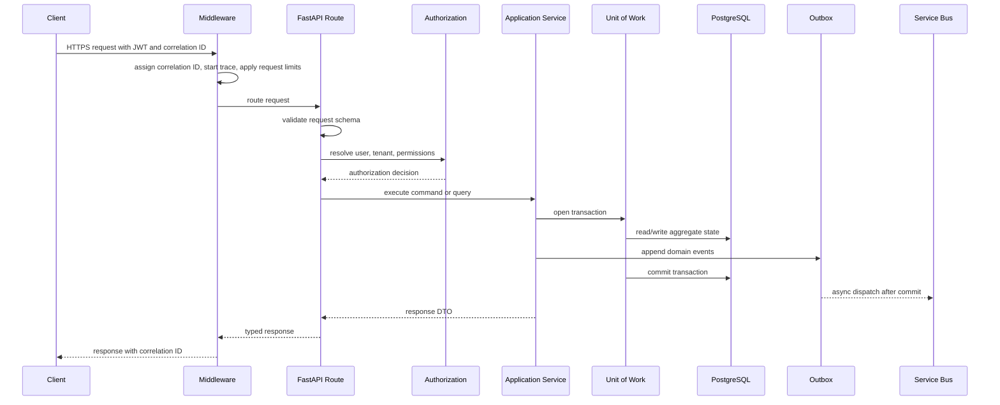

### Lifecycle Requirements

- Every request has a correlation ID.
- Every authenticated request resolves a tenant context.
- Every tenant-scoped operation enforces object-level authorization.
- Writes use a Unit of Work and emit audit events in the same transaction.
- Long-running operations return job resources rather than blocking.
- External dependency calls have timeouts, retries, and circuit-breaker policies.
- Errors are mapped to stable API error codes.

## 7. API Surface and Flow

### Authentication and Session APIs

| Endpoint | Flow |
| --- | --- |
| `GET /api/v1/auth/me` | Validate JWT, resolve tenant memberships, return user profile and effective roles. |
| `POST /api/v1/auth/exchange` | Exchange Entra ID token for platform session token when using internal JWT mode. |
| `POST /api/v1/auth/logout` | Revoke session token or record logout event where applicable. |

Authentication flow:

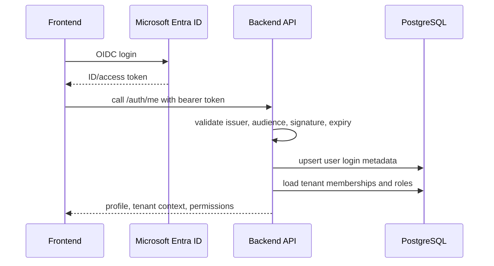

### Tenant and RBAC APIs

| Endpoint | Command or Query | Authorization |
| --- | --- | --- |
| `GET /api/v1/tenants/current` | GetCurrentTenantQuery | Any authenticated tenant member. |
| `PATCH /api/v1/tenants/current/settings` | UpdateTenantSettingsCommand | Admin only. |
| `GET /api/v1/users` | ListUsersQuery | Admin, limited manager view. |
| `POST /api/v1/users/invitations` | InviteUserCommand | Admin only. |
| `PUT /api/v1/users/{id}/roles` | AssignUserRolesCommand | Admin only. |

### Project and Architecture APIs

| Endpoint | Flow |
| --- | --- |
| `POST /api/v1/projects` | Validate tenant role, create project, emit audit event. |
| `GET /api/v1/projects` | Apply tenant and user membership filters, return paginated projects. |
| `POST /api/v1/projects/{id}/architectures` | Create workload architecture container. |
| `POST /api/v1/architectures/{id}/versions` | Create immutable architecture version from submitted metadata or uploaded evidence. |
| `GET /api/v1/architectures/{id}/graph` | Return architecture components, relationships, confidence, and source references. |

Architecture versioning rule:

- Reviews must target `architecture_versions`, never mutable architecture drafts.
- Any material evidence change creates a new version.
- Findings stay attached to the version they analyzed.

### Upload APIs

| Endpoint | Flow |
| --- | --- |
| `POST /api/v1/uploads/initiate` | Validate metadata, create asset row, issue short-lived SAS URL. |
| `POST /api/v1/uploads/complete` | Validate checksum, mark upload complete, enqueue ingestion job. |
| `GET /api/v1/uploads/{id}/status` | Return upload, scan, parse, and indexing status. |

Upload flow:

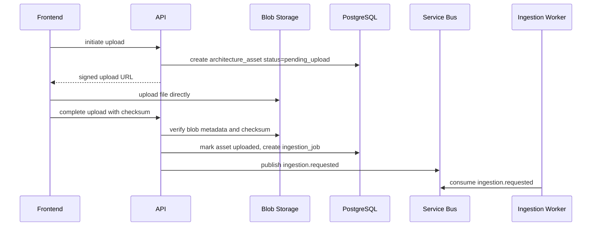

### Knowledge and Ingestion APIs

| Endpoint | Flow |
| --- | --- |
| `POST /api/v1/knowledge/sources` | Register tenant policy source or global admin source. |
| `POST /api/v1/knowledge/ingestions` | Start ingestion for a source or uploaded asset. |
| `GET /api/v1/knowledge/ingestions/{id}` | Return extraction, chunking, embedding, and indexing progress. |
| `GET /api/v1/knowledge/sources` | List accessible sources with trust level and ingestion state. |

Ingestion worker flow:

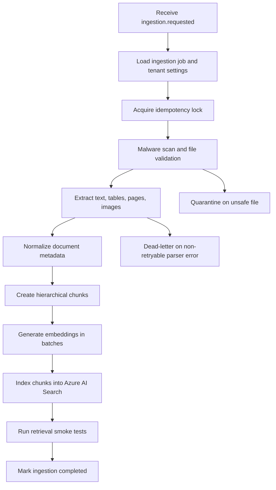

### Review APIs

| Endpoint | Flow |
| --- | --- |
| `POST /api/v1/reviews` | Create review for project and architecture version. |
| `POST /api/v1/reviews/{id}/run` | Start async review run, return job status. |
| `GET /api/v1/reviews/{id}` | Return review metadata, status, scores, summary. |
| `GET /api/v1/reviews/{id}/scores` | Return pillar score breakdown and confidence. |
| `GET /api/v1/reviews/{id}/findings` | Return findings with filters for pillar, severity, status. |
| `PATCH /api/v1/findings/{id}` | Reviewer status update, annotation, assignment, or remediation update. |

Review execution flow:

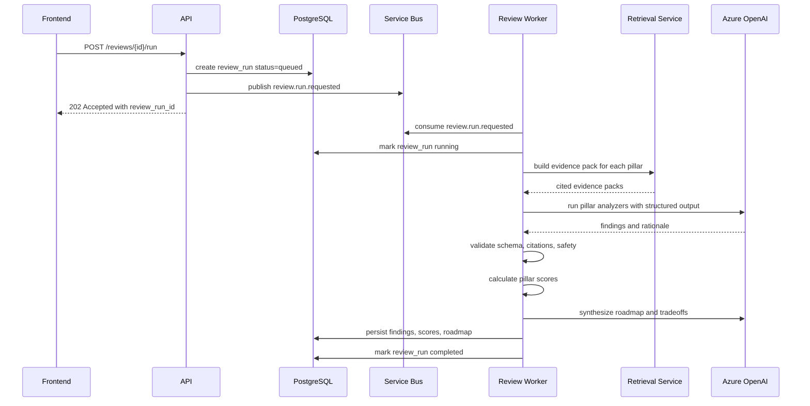

### Chat APIs

| Endpoint | Flow |
| --- | --- |
| `POST /api/v1/chat/sessions` | Create chat session scoped to tenant, project, or review. |
| `POST /api/v1/chat/sessions/{id}/messages` | Send message, retrieve context, stream grounded response. |
| `GET /api/v1/chat/sessions/{id}` | Return message history and citations. |

Chat flow:

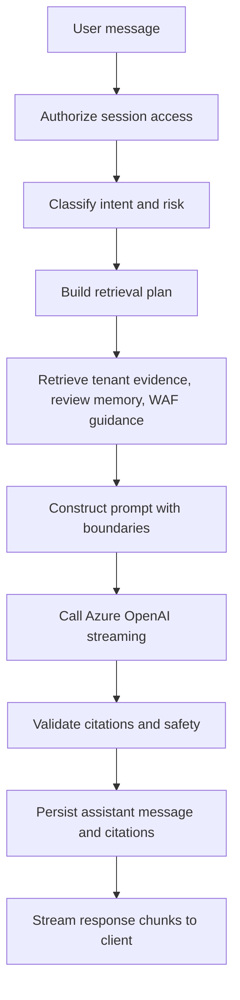

Chat controls:

- Chat cannot access documents outside the session tenant/project scope.
- Chat must cite sources for architecture-specific claims.
- Chat can answer general Azure guidance from global WAF indexes.
- Chat must ask clarifying questions when architecture evidence is insufficient.

### Report APIs

| Endpoint | Flow |
| --- | --- |
| `POST /api/v1/reviews/{id}/reports` | Create report generation job. |
| `GET /api/v1/reports/{id}` | Return generation status and metadata. |
| `GET /api/v1/reports/{id}/download` | Authorize access and issue short-lived download URL. |

Report generation flow:

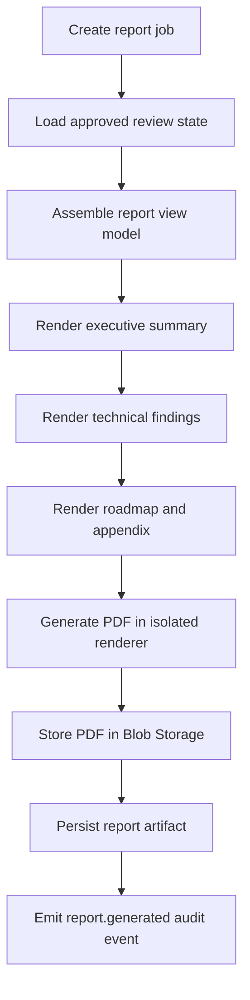

### Admin APIs

| Endpoint | Purpose |
| --- | --- |
| `GET /api/v1/admin/audit` | Search audit logs by actor, action, resource, and time window. |
| `GET /api/v1/admin/usage` | Tenant usage, model cost estimates, ingestion volume, report count. |
| `GET /api/v1/admin/model-invocations` | Model call metadata, latency, token usage, status, operation type. |
| `GET /api/v1/admin/health/dependencies` | Privileged dependency health view. |

## 8. RAG Backend Architecture

### Retrieval Service Responsibilities

The retrieval service is the only application-layer service allowed to compose RAG evidence packs. Review analyzers and chat orchestration consume evidence packs instead of calling search directly.

```mermaid
flowchart LR
    Query[Review question or chat message] --> Planner[Query Planner]
    Planner --> Filters[Authorization and Metadata Filters]
    Filters --> Hybrid[Hybrid Retriever]
    Hybrid --> Search[Azure AI Search]
    Search --> Rerank[Reranking and Diversity]
    Rerank --> Pack[Evidence Pack Builder]
    Pack --> Validate[Citation Validator]
    Validate --> Consumer[Review or Chat Orchestrator]
```

### Evidence Pack Contract

An evidence pack contains:

- Query intent.
- Tenant, project, review, and architecture version scope.
- Search filters used.
- Retrieved chunks with document IDs, chunk keys, titles, page numbers, source URIs, trust levels, and scores.
- Evidence classification: confirmed fact, policy, guidance, historical decision, or inferred clue.
- Token budget allocation.
- Missing evidence notes.

### Retrieval Query Types

| Query Type | Used By | Behavior |
| --- | --- | --- |
| `pillar_review` | Review engine | Decomposes by pillar and Azure service category. |
| `finding_validation` | Review engine | Retrieves supporting/contradictory evidence for a candidate finding. |
| `chat_consulting` | Chat | Conversational query with project/review memory. |
| `policy_lookup` | Review and chat | Tenant standards and exceptions first, global guidance second. |
| `report_citation` | Report generation | Fetches stable citation metadata for final report. |

### Search Filter Model

Every search query must include:

- `tenant_id` for tenant-owned indexes.
- `project_id` or explicit permission scope where applicable.
- `architecture_version_id` for review evidence queries.
- `acl_principals` when document-level ACLs are present.
- Optional filters: `pillar`, `azure_service`, `environment`, `region`, `source_type`, `trust_level`, `effective_date`.

## 9. AI Review Engine Architecture

### Review Engine Modules

| Module | Responsibility |
| --- | --- |
| `analyzers/security.py` | Identity, network isolation, data protection, threat detection, secure configuration, compliance. |
| `analyzers/reliability.py` | Availability targets, redundancy, backup, DR, failure modes, resiliency testing. |
| `analyzers/performance_efficiency.py` | Scalability, capacity, caching, latency, load testing, right service selection. |
| `analyzers/cost_optimization.py` | SKU fit, autoscaling, commitment discounts, waste, tagging, budgets, unit economics. |
| `analyzers/operational_excellence.py` | IaC, CI/CD, observability, incident response, change management, automation. |
| `scoring/score_calculator.py` | Converts validated findings and evidence completeness into scores. |
| `synthesis/roadmap.py` | Sequences improvements by risk, dependency, effort, and business impact. |
| `validators/evidence_validator.py` | Ensures material findings have valid evidence and citations. |

### Review Worker Internal Flow

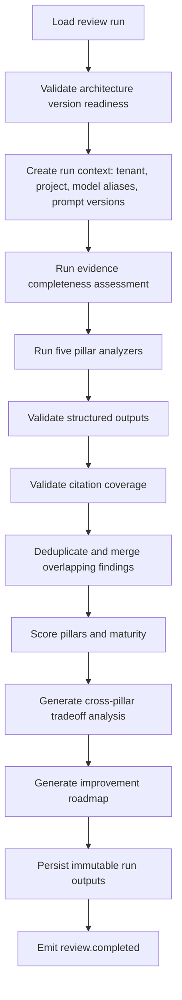

### Finding Output Contract

Every AI-generated finding must include:

- Pillar.
- Severity.
- Category.
- Title.
- Description.
- Evidence summary.
- Impact.
- Recommendation.
- Effort estimate.
- Priority.
- Confidence.
- Confirmed vs inferred status.
- Citations.
- Missing evidence, if any.
- Suggested remediation owner role.

### Scoring Controls

- Critical findings cap pillar scores unless explicitly accepted with compensating control.
- Missing evidence reduces confidence and can cap maturity level.
- Inferred findings cannot carry the same scoring weight as confirmed findings.
- Reviewer overrides are stored separately from AI outputs.
- Scoring formula versions are persisted with each review run.

## 10. Persistence Architecture

### Database Access

The backend uses SQLAlchemy 2.x async sessions with explicit Unit of Work boundaries.

| Pattern | Rule |
| --- | --- |
| Unit of Work | One write use case equals one transaction unless the workflow is explicitly long-running. |
| Repositories | Repository methods are tenant-aware and aggregate-oriented. |
| Read Models | Complex dashboard queries may use optimized query services or materialized views. |
| Migrations | Alembic migrations are required for every schema change. |
| Row-level Security | Tenant-owned tables enforce RLS in production. |
| Outbox | Domain events are committed with state changes, then dispatched asynchronously. |

### Transaction Boundaries

| Use Case | Transaction Strategy |
| --- | --- |
| Create project | Single transaction. |
| Complete upload | Single transaction plus outbox event for ingestion. |
| Ingestion processing | Multiple checkpoint transactions by stage. |
| Review run | Multiple checkpoint transactions by stage and pillar. |
| Chat message | User message commit, model call outside transaction, assistant message commit. |
| Report generation | Job state checkpoints plus final artifact commit. |

### Idempotency

Idempotency is required for:

- Upload completion.
- Review run creation.
- Report generation.
- Ingestion job creation.
- External connector sync callbacks.

Idempotency keys are scoped by tenant, user/client, route, and request body hash.

## 11. Event and Queue Architecture

### Domain Events

| Event | Producer | Consumer |
| --- | --- | --- |
| `tenant.created` | Tenant command | Provisioning workflow, audit. |
| `architecture.asset_uploaded` | Upload command | Ingestion service. |
| `ingestion.requested` | Ingestion command | Ingestion worker. |
| `ingestion.completed` | Ingestion worker | Review readiness updater. |
| `review.run_requested` | Review command | Review worker. |
| `review.completed` | Review worker | Notification service, analytics rollup. |
| `report.requested` | Report command | Report worker. |
| `report.generated` | Report worker | Notification service, audit. |
| `finding.updated` | Finding command | Audit, analytics, optional notifications. |

### Queue Design

| Queue | Consumer | Retry Policy |
| --- | --- | --- |
| `ingestion-jobs` | Ingestion worker | Retry transient parser/storage/search/model failures; DLQ unsafe or unsupported files. |
| `review-jobs` | Review worker | Retry transient retrieval/model errors; checkpoint by pillar to avoid full reruns. |
| `report-jobs` | Report worker | Retry renderer/storage failures; DLQ invalid report state. |
| `notifications` | Notification worker | Retry provider failures; suppress duplicate notifications. |
| `outbox-dispatch` | Outbox dispatcher | Poll and publish committed domain events. |

Message requirements:

- Stable message ID for duplicate detection.
- Correlation ID and causation ID.
- Tenant ID and resource ID.
- Schema version.
- Retry count and first-enqueued timestamp.

## 12. Security Architecture Inside Backend

### Authorization Flow

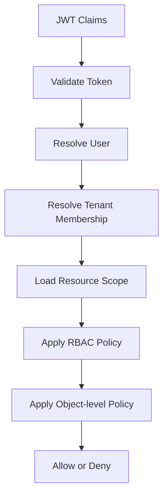

### Security Controls

| Control | Backend Implementation |
| --- | --- |
| JWT validation | JWKS cache, issuer/audience validation, expiry checks, clock skew limits. |
| Tenant isolation | Tenant context required for scoped routes, repository filters, RLS, search filters. |
| RBAC | Role policies in application layer and route dependencies. |
| Object authorization | Project/review/finding/report ownership checked before access. |
| Secrets | Managed identity and Key Vault references, no secrets in settings files. |
| Prompt injection | Input classification, prompt boundaries, retrieved-content labeling, tool allowlists. |
| Sensitive logging | Redaction filters for prompts, tokens, document text, SAS URLs, and PII. |
| Upload safety | File type allowlist, size limits, checksum verification, malware scan, quarantine. |
| Rate limits | Tenant, user, IP, API client, model operation, and upload limits. |
| Audit | Append-only records for sensitive actions. |

### Backend Permission Names

```text
tenant.settings.read
tenant.settings.write
users.read
users.invite
users.roles.write
projects.read
projects.write
architectures.read
architectures.write
uploads.write
knowledge.read
knowledge.write
reviews.read
reviews.run
findings.review
chat.write
reports.read
reports.generate
audit.read
usage.read
```

## 13. Observability and Operations

### Telemetry Signals

| Signal | Examples |
| --- | --- |
| Logs | Request logs, auth failures, review stage changes, ingestion parser errors. |
| Traces | API request, DB query spans, search query spans, model invocation spans, worker spans. |
| Metrics | Request latency, error rate, queue age, job duration, token usage, search latency, report render time. |
| Audit | User and admin actions, report downloads, finding approvals, role changes. |
| AI quality | Citation coverage, groundedness score, retrieval precision, validation failures. |

### Required Dashboards

- API health: latency, throughput, error rate, status codes.
- Worker health: queue age, retry counts, DLQ count, job duration.
- AI operations: token usage, model latency, model error rates, content filter events.
- RAG quality: retrieval latency, citation coverage, empty retrieval rate, top-K score distribution.
- Tenant usage: active users, uploads, reviews, reports, chat messages, model cost estimate.
- Security: denied authorization, anomalous downloads, admin changes, suspicious prompt activity.

### Logging Rules

- Use structured JSON logs.
- Include correlation ID, tenant ID hash, user ID hash, operation, resource type, resource ID, and status.
- Do not log raw JWTs, SAS URLs, secrets, full prompts, raw uploaded text, or full model outputs by default.
- Log model metadata and token usage, not sensitive prompt content.

## 14. Error Handling

### Error Categories

| Category | HTTP Status | Examples |
| --- | --- | --- |
| Authentication | 401 | Missing token, expired token, invalid issuer. |
| Authorization | 403 | Missing permission, resource outside tenant. |
| Validation | 422 | Invalid request body, unsupported file type. |
| Conflict | 409 | Duplicate idempotency key with different body, invalid state transition. |
| Not Found | 404 | Resource not found or intentionally hidden due to authorization. |
| Rate Limit | 429 | Tenant or user quota exceeded. |
| Dependency | 502/503 | Azure OpenAI, Search, Blob, Service Bus transient failures. |
| Internal | 500 | Unexpected server error with correlation ID. |

### Dependency Handling

- All external calls have explicit timeouts.
- Retry only safe, idempotent operations or operations with idempotency keys.
- Use exponential backoff with jitter.
- Use circuit breakers for Azure OpenAI and Azure AI Search.
- Record dependency error class and retry state in telemetry.
- Surface stable user-facing error messages.

## 15. Configuration Architecture

### Configuration Sources

| Source | Purpose |
| --- | --- |
| Environment variables | Local and container bootstrap values. |
| Azure App Configuration | Feature flags, non-secret runtime settings, model aliases. |
| Azure Key Vault | Secrets, certificate references, customer-managed key URIs. |
| Database tenant settings | Tenant-level policies, quotas, retention, model preferences. |

### Model Alias Strategy

Application code must use model aliases, not direct deployment names.

```text
review.primary.chat
review.fallback.chat
chat.primary.chat
embeddings.primary
vision.diagram_analysis
```

The model router resolves aliases to Azure OpenAI deployment names based on tenant, region, feature flag, quota, and availability.

## 16. API Versioning and Contracts

### Versioning

- Public routes use `/api/v1`.
- Breaking changes require `/api/v2`.
- Non-breaking field additions are allowed.
- Deprecated fields remain for at least one supported release window.
- Internal Service Bus messages carry independent schema versions.

### DTO Rules

- API DTOs are separate from SQLAlchemy models and domain aggregates.
- Request DTOs validate shape and primitive constraints.
- Application commands validate state and authorization.
- Response DTOs never expose internal IDs that are not needed by clients.
- Sensitive fields are omitted or masked by default.

## 17. Testing Architecture

| Test Type | Scope |
| --- | --- |
| Unit | Domain rules, scoring logic, authorization policies, prompt rendering, validators. |
| Integration | PostgreSQL repositories, Redis rate limiter, Azure SDK adapters with test doubles or test resources. |
| Contract | OpenAPI schema, frontend/backend DTO compatibility, Service Bus message schemas. |
| Security | Tenant isolation, RBAC, IDOR, upload validation, prompt injection fixtures. |
| AI evals | Retrieval precision, groundedness, citation coverage, review consistency, scoring regression. |
| Performance | API load, review worker throughput, ingestion throughput, search latency. |

### Minimum Release Gates

- No cross-tenant access in automated isolation tests.
- Review output schema validation pass rate above threshold.
- Citation coverage above threshold for high/critical findings.
- API contract tests pass.
- Alembic migration upgrade and downgrade tested for release branch.
- Dependency vulnerability scan passes policy.

## 18. Implementation Sequence

### Milestone 1: Backend Foundation

- FastAPI bootstrap, settings, structured logging, exception middleware.
- SQLAlchemy async session, Alembic baseline, health endpoints.
- Auth validator and tenant context dependency.
- Core domain entities for tenants, users, projects, architectures.

### Milestone 2: Secure CRUD and Uploads

- RBAC and object authorization service.
- Project and architecture APIs.
- Upload initiate/complete APIs.
- Blob adapter and malware scanning provider contract with quarantine workflow.
- Audit logs and idempotency store.

### Milestone 3: Ingestion and Search

- Ingestion jobs and Service Bus worker.
- Document extraction adapter.
- Chunking and metadata pipeline.
- Embedding adapter and Azure AI Search indexing.
- Retrieval service with hybrid search and citations.

### Milestone 4: Review Engine

- Review run lifecycle.
- Pillar analyzers and structured output validation.
- Scoring and maturity model.
- Finding persistence and review approval workflow.
- Usage and model invocation logging.

### Milestone 5: Chat and Reports

- Chat sessions and grounded responses.
- Review-aware chat context.
- Report generation worker.
- PDF artifact storage and secure download.

### Milestone 6: Production Hardening

- Rate limits, quotas, circuit breakers.
- DLQ handling and worker recovery.
- OpenTelemetry dashboards.
- Security test suite.
- AI eval pipeline.
- Backup, restore, and runbooks.
