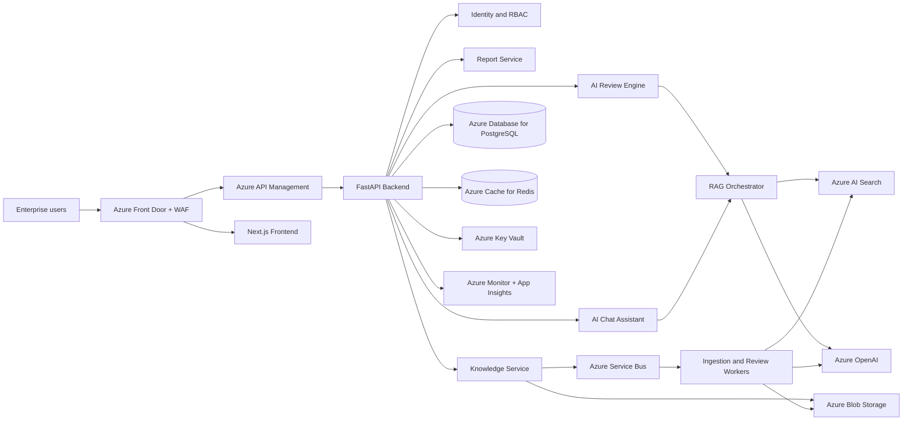
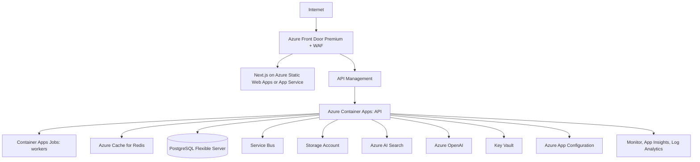

# AI Azure Well-Architected Review Assistant

## 1. Enterprise System Architecture

### Product Mission

AI Azure Well-Architected Review Assistant is an enterprise SaaS platform that automates Azure Well-Architected Framework reviews across Security, Reliability, Performance Efficiency, Cost Optimization, and Operational Excellence. The platform ingests customer architecture evidence, grounds analysis in Microsoft guidance and tenant policy, generates cited review findings, scores workload maturity, and supports consultant-grade chat.

### Architectural Principles

- Multi-tenant by default, with optional dedicated tenant stamps for regulated customers.
- Evidence-first AI: every material finding must trace to architecture evidence, tenant policy, or curated Azure guidance.
- Human-reviewable outputs: every score, risk, and recommendation is stored as structured data and can be approved, overridden, or dismissed.
- Azure-native security: Microsoft Entra ID, managed identities, Key Vault, Private Link, Defender, Monitor, and policy-driven deployment.
- Clean architecture: domain logic isolated from transport, infrastructure, AI providers, and orchestration frameworks.
- AI provider abstraction: Azure OpenAI is the production provider, but model deployments are referenced through internal aliases.
- Future-ready multimodal analysis: documents and diagrams are normalized into an architecture evidence graph.

### Logical Architecture



### Bounded Contexts

| Context | Responsibility |
| --- | --- |
| Identity and Access | JWT validation, Entra ID federation, tenant membership, RBAC, object-level authorization. |
| Tenant and Workspace | Organizations, projects, workload inventory, data residency, subscription boundaries. |
| Architecture Evidence | Documents, diagrams, Azure exports, questionnaires, topology graph, extracted metadata. |
| Knowledge Management | Source registration, ingestion jobs, chunking, embeddings, index lifecycle, citations. |
| Review Engine | Pillar analysis, finding generation, maturity scoring, risk prioritization, roadmap synthesis. |
| Chat Assistant | Conversational consulting grounded in tenant context, review history, and curated guidance. |
| Reporting | Executive summaries, technical reports, PDF generation, evidence packs, export history. |
| Governance and Audit | Audit logs, model invocation records, approval workflow, policy traceability, admin analytics. |

### Core Workflows

1. Tenant admin configures SSO, roles, data region, model deployment aliases, and organization policies.
2. Architect creates a project and workload review.
3. Users upload architecture evidence: PDFs, Word documents, PowerPoint decks, markdown, exports, IaC, and diagrams.
4. Ingestion pipeline stores raw files, extracts text and metadata, chunks content, embeds chunks, and indexes them with tenant and ACL metadata.
5. Review engine retrieves Well-Architected guidance, tenant policy, and workload evidence.
6. Pillar-specific analyzers produce structured findings, scores, citations, and confidence levels.
7. Cross-pillar synthesis resolves tradeoffs and generates an improvement roadmap.
8. Reviewers approve or edit findings.
9. Reporting service generates PDF and structured exports.
10. Chat assistant uses the same RAG layer plus review state for follow-up consultation.

## 2. Detailed Folder Structure

```text
ai-azure-waf-review-assistant/
  README.md
  .env.example
  docker-compose.yml
  Makefile
  docs/
    architecture/
      enterprise-system-architecture.md
      adr/
      threat-model/
      runbooks/
    product/
      personas.md
      review-methodology.md
      scoring-model.md
    api/
      openapi-overview.md
  frontend/
    package.json
    next.config.ts
    tailwind.config.ts
    src/
      app/
        (auth)/
        dashboard/
        projects/
        reviews/
        chat/
        uploads/
        reports/
        admin/
      components/
        auth/
        charts/
        layout/
        reviews/
        chat/
        uploads/
        reports/
      lib/
        api/
        auth/
        telemetry/
        validators/
      stores/
      styles/
      tests/
  backend/
    pyproject.toml
    alembic.ini
    app/
      main.py
      api/
        dependencies.py
        middleware.py
        v1/
          auth.py
          tenants.py
          users.py
          projects.py
          architectures.py
          uploads.py
          reviews.py
          findings.py
          chat.py
          reports.py
          knowledge.py
          admin.py
      core/
        config.py
        security.py
        logging.py
        telemetry.py
        exceptions.py
        rate_limits.py
      domain/
        identity/
        tenants/
        architectures/
        reviews/
        knowledge/
        chat/
        reports/
        audit/
      application/
        commands/
        queries/
        services/
        policies/
      infrastructure/
        db/
        repositories/
        azure_openai/
        azure_search/
        blob_storage/
        service_bus/
        document_intelligence/
        email/
      rag/
        retrievers/
        chunking/
        embeddings/
        citations/
        reranking/
        evaluators/
      review_engine/
        analyzers/
        scoring/
        schemas/
        validators/
        orchestration/
      workers/
        ingestion_worker.py
        review_worker.py
        report_worker.py
      migrations/
      tests/
        unit/
        integration/
        contract/
        security/
  ingestion/
    connectors/
      blob/
      sharepoint/
      confluence/
      github/
      azure_resource_graph/
    parsers/
    normalizers/
    pipelines/
  prompts/
    system/
    review/
      security.md
      reliability.md
      performance_efficiency.md
      cost_optimization.md
      operational_excellence.md
      synthesis.md
    chat/
    reporting/
    evaluation/
  infrastructure/
    bicep/
      modules/
      environments/
    terraform/
      modules/
      environments/
    helm/
    policies/
    scripts/
  deployment/
    docker/
    github-actions/
    azure-devops/
    load-tests/
  configs/
    appsettings.local.yaml
    appsettings.dev.yaml
    appsettings.prod.yaml
  tests/
    e2e/
    performance/
    ai-evals/
    fixtures/
```

## 3. Tech Stack Justification

| Layer | Choice | Rationale |
| --- | --- | --- |
| Frontend | Next.js, React, TypeScript, Tailwind CSS | Enterprise dashboard patterns, SSR where useful, strong typing, accessible component composition, fast iteration. |
| Charts | ECharts or Recharts | Pillar scoring, roadmap burndown, severity distribution, tenant analytics. |
| API | FastAPI | Async Python, OpenAPI-first, strong dependency injection pattern, excellent fit for AI orchestration services. |
| Domain/Data | SQLAlchemy 2.x, Alembic, PostgreSQL | Mature relational modeling, migrations, JSONB for architecture evidence, row-level security support. |
| Cache | Azure Cache for Redis | Session-adjacent cache, rate limit counters, idempotency keys, short-lived retrieval results. |
| Queue | Azure Service Bus | Durable enterprise messaging, DLQs, retry policies, async ingestion and review execution. |
| Object Store | Azure Blob Storage | Raw documents, normalized artifacts, generated reports, versioned evidence packs. |
| Vector/RAG | Azure AI Search | Managed vector, keyword, hybrid, semantic ranking, filters, RBAC-friendly enterprise search. |
| AI Models | Azure OpenAI GPT-4o plus embedding deployments | Multimodal-ready analysis, structured review generation, chat, future diagram interpretation. |
| Orchestration | Semantic Kernel primary, adapter boundary for LangChain | Azure-native plugin/tooling model while keeping the application independent of orchestration libraries. |
| Auth | Microsoft Entra ID OIDC plus internal JWT session support | Enterprise SSO, conditional access, group claims, service principals, workload identity. |
| Deployment | Azure Container Apps for SaaS MVP, AKS for high-control enterprise tier | ACA reduces operational overhead; AKS remains available for regulated or complex networking customers. |
| Observability | Azure Monitor, Application Insights, Log Analytics, OpenTelemetry | Distributed tracing, structured logs, model latency/cost tracking, security analytics. |

## 4. Database Schema

### Tenancy and Identity

| Table | Key Fields |
| --- | --- |
| tenants | id, name, slug, plan, data_region, isolation_mode, status, created_at |
| tenant_settings | tenant_id, sso_config, allowed_domains, cmk_key_uri, retention_policy, model_policy |
| users | id, tenant_id, entra_object_id, email, display_name, status, last_login_at |
| roles | id, name: admin/architect/reviewer/manager, description |
| user_roles | user_id, tenant_id, role_id, project_id nullable |
| api_clients | id, tenant_id, name, credential_hash, scopes, expires_at, last_used_at |

### Workspaces and Architecture Evidence

| Table | Key Fields |
| --- | --- |
| projects | id, tenant_id, name, business_owner, criticality, regulatory_profile, status |
| architectures | id, tenant_id, project_id, name, description, lifecycle_stage, rto, rpo, traffic_profile, metadata_json |
| architecture_versions | id, architecture_id, version, change_summary, created_by, created_at |
| architecture_assets | id, tenant_id, architecture_version_id, asset_type, blob_path, checksum, parse_status, sensitivity_label |
| architecture_components | id, architecture_version_id, component_type, azure_service, name, region, tags_json |
| architecture_relationships | id, architecture_version_id, source_component_id, target_component_id, relation_type, metadata_json |

### Knowledge and RAG

| Table | Key Fields |
| --- | --- |
| knowledge_sources | id, tenant_id nullable, source_type, title, uri, version, trust_level, effective_at |
| documents | id, tenant_id nullable, source_id, blob_path, title, doc_type, acl_json, status, checksum |
| document_chunks | id, document_id, chunk_key, parent_chunk_key, ordinal, token_count, content_hash, metadata_json |
| ingestion_jobs | id, tenant_id, source_id, status, started_at, completed_at, error_code, retry_count |
| search_indexes | id, tenant_id nullable, name, purpose, schema_version, status |
| retrieval_events | id, tenant_id, user_id, review_id nullable, query_hash, filters_json, top_k, latency_ms, trace_id |

### Reviews, Findings, and Reports

| Table | Key Fields |
| --- | --- |
| reviews | id, tenant_id, project_id, architecture_version_id, status, review_type, started_by, approved_by, completed_at |
| review_runs | id, review_id, run_number, model_alias, prompt_version, status, token_usage_json, cost_estimate |
| pillar_scores | id, review_id, pillar, score, maturity_level, confidence, rationale |
| findings | id, review_id, pillar, severity, category, title, description, impact, recommendation, effort, priority, status |
| finding_citations | id, finding_id, source_type, document_id nullable, chunk_key nullable, source_uri, page_number, quote_hash |
| improvement_items | id, review_id, finding_id, title, target_state, owner_role, effort, sequence, dependency_json |
| reports | id, review_id, report_type, format, blob_path, generated_by, generated_at |

### Chat, Audit, and Operations

| Table | Key Fields |
| --- | --- |
| chat_sessions | id, tenant_id, project_id nullable, review_id nullable, user_id, title, created_at |
| chat_messages | id, session_id, role, content, redacted_content, token_usage_json, created_at |
| chat_citations | id, message_id, document_id nullable, chunk_key nullable, source_uri |
| audit_logs | id, tenant_id, actor_id, action, resource_type, resource_id, ip_hash, user_agent_hash, metadata_json, created_at |
| model_invocations | id, tenant_id, operation, model_alias, prompt_version, latency_ms, input_tokens, output_tokens, status |
| outbox_events | id, tenant_id, event_type, payload_json, status, available_at, attempts |

### Data Model Rules

- Every tenant-owned table includes `tenant_id` and is protected by application authorization plus PostgreSQL row-level security.
- Global Microsoft guidance can be indexed once; tenant documents and policies are isolated by index filter or dedicated index based on tenant tier.
- Findings and scores are immutable per review run; edits create reviewer annotations or new review versions.
- Audit logs are append-only and partitioned by month.
- Model invocation records must never store raw secrets, credentials, or full sensitive prompts by default.

## 5. API Architecture

### API Standards

- REST APIs under `/api/v1`.
- OpenAPI generated from FastAPI and published to internal developer portal.
- JWT bearer authentication for user APIs.
- Client credentials or signed service tokens for ingestion connectors.
- Idempotency keys for upload, review creation, report generation, and ingestion job creation.
- Cursor pagination for lists.
- Consistent envelope for errors: `code`, `message`, `correlation_id`, `details`.
- RBAC enforced at route, command, and repository layers.

### Core API Surface

| Area | Endpoints |
| --- | --- |
| Auth | `GET /auth/me`, `POST /auth/exchange`, `POST /auth/logout` |
| Tenants | `GET /tenants/current`, `PATCH /tenants/current/settings` |
| Users/RBAC | `GET /users`, `POST /users/invitations`, `PUT /users/{id}/roles` |
| Projects | `GET /projects`, `POST /projects`, `GET /projects/{id}`, `PATCH /projects/{id}` |
| Architectures | `POST /projects/{id}/architectures`, `POST /architectures/{id}/versions`, `GET /architectures/{id}/graph` |
| Uploads | `POST /uploads/initiate`, `POST /uploads/complete`, `GET /uploads/{id}/status` |
| Knowledge | `POST /knowledge/sources`, `POST /knowledge/ingestions`, `GET /knowledge/ingestions/{id}` |
| Reviews | `POST /reviews`, `POST /reviews/{id}/run`, `GET /reviews/{id}`, `GET /reviews/{id}/scores` |
| Findings | `GET /reviews/{id}/findings`, `PATCH /findings/{id}`, `POST /findings/{id}/comments` |
| Chat | `POST /chat/sessions`, `POST /chat/sessions/{id}/messages`, `GET /chat/sessions/{id}` |
| Reports | `POST /reviews/{id}/reports`, `GET /reports/{id}`, `GET /reports/{id}/download` |
| Admin | `GET /admin/audit`, `GET /admin/usage`, `GET /admin/model-invocations` |

### Authorization Matrix

| Capability | Admin | Architect | Reviewer | Manager |
| --- | --- | --- | --- | --- |
| Manage tenant settings | Yes | No | No | No |
| Manage users and roles | Yes | No | No | No |
| Create projects and architectures | Yes | Yes | No | No |
| Upload evidence | Yes | Yes | Yes | No |
| Run AI review | Yes | Yes | Yes | No |
| Approve findings | Yes | No | Yes | No |
| View executive reports | Yes | Yes | Yes | Yes |
| View audit logs | Yes | No | No | Limited |

## 6. RAG Pipeline Design

### Source Types

- Microsoft Azure Well-Architected Framework guidance.
- Azure Architecture Center reference architectures.
- Azure service guides and design checklists.
- Tenant cloud standards, security baselines, landing-zone policies, compliance mappings.
- Customer architecture evidence: diagrams, IaC, assessment questionnaires, exports, operational docs.
- Future connectors: Azure Resource Graph, Azure Advisor, Defender for Cloud, Azure Monitor, SharePoint, Confluence, GitHub.

### Ingestion Pipeline

```mermaid
flowchart LR
    Source[Document or connector] --> Raw[Raw blob storage]
    Raw --> Event[Event Grid]
    Event --> Queue[Service Bus ingestion queue]
    Queue --> Extract[Extract text, tables, images, metadata]
    Extract --> Classify[Classify sensitivity and document type]
    Classify --> Normalize[Normalize to canonical evidence schema]
    Normalize --> Chunk[Hierarchical chunking]
    Chunk --> Embed[Azure OpenAI embeddings]
    Embed --> Index[Azure AI Search indexes]
    Index --> Eval[Retrieval quality checks]
```



### Chunking Strategy

- Preserve heading hierarchy, page numbers, source URLs, document version, and access control metadata.
- Use parent-child chunking: parent sections for context, child chunks for precise retrieval.
- Separate architecture facts from narrative text when possible.
- Attach metadata: pillar, Azure service, region, environment, control family, workload criticality, source trust level.
- Maintain chunk hashes for deduplication and citation stability.

### Azure AI Search Indexes

| Index | Scope | Purpose |
| --- | --- | --- |
| `global-waf-guidance` | Shared | Microsoft Well-Architected guidance, service guides, design principles. |
| `global-azure-reference` | Shared | Reference architectures, landing-zone patterns, service implementation notes. |
| `tenant-policy-{tenant}` | Tenant | Internal standards, regulatory mappings, exceptions, approved patterns. |
| `tenant-evidence-{tenant}` | Tenant | Uploaded architecture docs, diagrams, IaC, exports, questionnaires. |
| `tenant-review-memory-{tenant}` | Tenant | Approved findings, historical decisions, remediation outcomes. |

### Retrieval Flow

1. Classify user/review intent.
2. Decompose complex questions into pillar-specific subqueries.
3. Apply tenant, project, ACL, source-type, pillar, service, and recency filters.
4. Execute hybrid search: keyword plus vector query.
5. Use semantic ranking where appropriate for descriptive guidance.
6. Apply reranking and diversity selection to avoid repetitive chunks.
7. Build a compact evidence pack with citations and confidence signals.
8. Pass evidence pack to the review/chat prompt with strict grounding instructions.
9. Validate response schema and citation coverage before persistence.

### Grounding and Citation Rules

- Any recommendation marked high or critical must include at least one citation to architecture evidence and one citation to guidance or tenant policy when available.
- If evidence is missing, generate a "missing evidence" finding instead of inventing architecture state.
- Store source URI, document ID, chunk key, page number, and quote hash for every citation.
- Responses must distinguish confirmed observations, inferred risks, and questions requiring human validation.

### RAG Evaluation

- Retrieval precision at top K for curated benchmark questions.
- Citation coverage by finding severity.
- Groundedness scoring using automated eval prompts and sampled human review.
- Regression test set per pillar and per Azure service family.
- Latency budgets by operation: chat under seconds, full review allowed async execution.

## 7. Deployment Architecture

### Azure Production Topology



### Environment Strategy

| Environment | Purpose | Isolation |
| --- | --- | --- |
| Local | Developer productivity | Docker Compose, local Postgres, local Redis, Azurite, mocked AI where possible. |
| Dev | Integration | Shared non-production Azure resources, synthetic data only. |
| Test | Contract, AI eval, performance | Production-like indexes, redacted fixtures, load tests. |
| Stage | Release validation | Production topology, private networking, synthetic tenant. |
| Prod | Customer workloads | Regional deployment stamps, private endpoints, strict policy. |

### Runtime Services

- API service: FastAPI, stateless, horizontally scaled.
- Worker services: ingestion, review execution, report generation, scheduled maintenance.
- Report renderer: isolated container with restricted egress.
- Background jobs: Service Bus queues with DLQs and retry policies.
- Blob lifecycle: raw, normalized, report, and quarantine containers.
- Search lifecycle: blue/green index creation for schema changes.

### Networking

- Azure Front Door Premium with WAF policy and custom domains.
- API Management for throttling, API keys for service integrations, and request policy enforcement.
- Private endpoints for PostgreSQL, Storage, Azure AI Search, Key Vault, and Azure OpenAI where supported.
- Managed identities for service-to-service auth.
- No public database access.
- Egress controlled through NAT Gateway or Azure Firewall in higher tiers.

### Scalability and Resilience

- Stateless API autoscaling on CPU, concurrency, and queue depth.
- Worker autoscaling on Service Bus backlog.
- PostgreSQL read replicas for analytics-heavy tenants.
- Azure AI Search index partition/replica scaling based on corpus and query volume.
- Regional stamp model for data residency and blast-radius control.
- Async review runs so long-running analysis does not block the UI.
- Retry with exponential backoff for transient Azure OpenAI/Search/Storage failures.
- Circuit breakers around model calls and retrieval dependencies.

## 8. MVP Roadmap

### Phase 0: Foundation

- Repository setup, architecture docs, ADR process, coding standards.
- FastAPI service skeleton with clean architecture boundaries.
- Next.js shell with authenticated layout and dashboard navigation.
- Docker Compose for local development.
- PostgreSQL schema baseline and Alembic migrations.

### Phase 1: Identity, Tenancy, and Uploads

- Entra ID OIDC login and JWT validation.
- Tenant/project/workload model.
- RBAC for admin, architect, reviewer, manager.
- Secure upload flow to Blob Storage.
- Audit logging for all sensitive actions.

### Phase 2: RAG Knowledge System

- Ingestion jobs for curated WAF corpus and tenant PDFs.
- Text extraction, chunking, embeddings, Azure AI Search indexing.
- Hybrid retrieval with filters and citations.
- Retrieval evaluation fixture set.

### Phase 3: AI Review Engine

- Pillar-specific review analyzers.
- Structured finding schema and validation.
- Scoring model and maturity levels.
- Review run lifecycle, retry, DLQ, model invocation logging.
- Human approval workflow.

### Phase 4: Chat and Reports

- Tenant/project-aware chat assistant.
- Review-grounded chat context.
- Executive and technical report templates.
- PDF generation and downloadable evidence packs.
- Dashboard charts for score and risk distribution.

### Phase 5: Production Hardening

- Observability dashboards.
- Rate limiting and quota policies.
- Security testing and threat model closure.
- CI/CD with IaC deployment.
- Backup, restore, and disaster recovery runbooks.

## 9. Production Roadmap

### Enterprise SaaS Capabilities

- Multi-region deployment stamps with customer data residency.
- Dedicated tenant mode with separate database, storage, and search indexes.
- SCIM provisioning and Entra group-to-role mapping.
- Bring-your-own-key encryption for premium tenants.
- Private Link customer ingestion endpoints.
- Admin usage analytics and chargeback-ready model cost reporting.
- Report branding and export templates.

### Advanced Architecture Intelligence

- Azure Resource Graph ingestion for discovered resource inventory.
- Terraform, Bicep, ARM, and Azure Policy parsing.
- Defender for Cloud, Azure Advisor, Cost Management, and Monitor integrations.
- Diagram analysis using GPT-4o vision and graph extraction.
- Architecture graph diffing between review versions.
- Risk trend analysis and remediation tracking.
- Organization-specific review playbooks.

### AI Quality and Governance

- Golden datasets per pillar.
- Continuous prompt evaluation.
- Groundedness and hallucination monitoring.
- Prompt/version registry.
- Model fallback policies.
- Tenant-specific safety policies.
- Human feedback loop for finding quality.

### Compliance and Operations

- SOC 2 readiness controls.
- ISO 27001-aligned security management evidence.
- Data retention and legal hold policies.
- Audit export to Microsoft Sentinel.
- DLP classification and malware scanning for uploads.
- Business continuity testing.
- SLOs for API, chat, ingestion, and report generation.

## 10. Security Architecture

### Identity and Access

- Microsoft Entra ID is the primary identity provider.
- Backend validates JWT issuer, audience, expiry, tenant, and signing keys.
- RBAC roles: admin, architect, reviewer, manager.
- Optional ABAC conditions: project membership, data sensitivity, geography, workload criticality.
- Service-to-service access uses managed identities, not static secrets.
- Admin actions require elevated authorization and full audit logging.

### Tenant Isolation

- Application-level tenant enforcement on every command/query.
- PostgreSQL row-level security for tenant-owned records.
- Tenant-scoped Blob prefixes or containers, with dedicated storage accounts for high-isolation tenants.
- Tenant-specific Azure AI Search indexes for regulated tiers; metadata-filtered shared indexes only for lower-risk shared guidance.
- Cross-tenant retrieval tests in CI to prevent index filter regressions.

### Data Protection

- TLS 1.2+ for all external and service-to-service traffic.
- Encryption at rest for PostgreSQL, Blob Storage, Azure AI Search, and Redis.
- Key Vault for secrets, certificates, and customer-managed keys where required.
- Sensitive prompt and document redaction before logging.
- Configurable retention for uploads, chat, reviews, audit records, and generated reports.
- Malware scanning and file type validation on uploads.

### AI Security Controls

- Prompt injection detection for uploaded content and chat input.
- Strict separation of system prompts, tenant policy, user input, and retrieved evidence.
- Tool allowlists for chat and review agents.
- Grounding-required prompts for material recommendations.
- Schema validation for model outputs.
- Citation validation before findings are persisted.
- Model invocation telemetry without raw sensitive data by default.
- Human review gates for high-severity recommendations before final report approval.

### Network Security

- Front Door WAF for OWASP protections and bot/rate controls.
- API Management for request throttling, JWT validation policy, and API product isolation.
- Private endpoints for core data and AI dependencies.
- No public PostgreSQL or storage data plane exposure in production.
- Environment-specific network segmentation.
- Egress restrictions for report rendering and document processing containers.

### Audit and Monitoring

- Append-only audit log for auth, uploads, review runs, finding edits, report downloads, admin changes.
- OpenTelemetry trace propagation across frontend, API, workers, and Azure dependencies.
- Security alerts for anomalous access, failed authorization, high-volume downloads, and suspicious prompt activity.
- Azure Monitor dashboards for latency, errors, queue age, token usage, model failures, and retrieval quality.
- Export path to Microsoft Sentinel for enterprise SOC integration.

### Threats Addressed

| Threat | Primary Controls |
| --- | --- |
| Cross-tenant data leakage | Tenant filters, RLS, dedicated indexes, CI isolation tests. |
| Prompt injection | Content classification, prompt boundaries, tool allowlists, output validation. |
| Insecure direct object reference | Object-level authorization and tenant-scoped repositories. |
| Secret leakage | Key Vault, managed identities, redacted logs, no secrets in prompts. |
| Malicious uploads | File validation, malware scanning, quarantine container, parser sandboxing. |
| Hallucinated recommendations | RAG grounding, citations, confidence labels, human approval workflow. |
| Excessive model cost | Quotas, rate limits, token budgets, model aliases, usage analytics. |
| Supply chain compromise | Dependency scanning, signed containers, SBOMs, CI policy gates. |

## Review Methodology

### Finding Severity

| Severity | Meaning |
| --- | --- |
| Critical | High likelihood of major outage, breach, regulatory failure, or severe business impact. |
| High | Material architectural weakness requiring near-term remediation. |
| Medium | Meaningful risk or optimization opportunity with bounded impact. |
| Low | Best-practice gap, hygiene issue, or improvement with limited immediate risk. |
| Informational | Observation, clarification, or design note. |

### Pillar Score

Each pillar receives a score from 0 to 100.

```text
pillar_score =
  100
  - weighted_finding_penalties
  - missing_evidence_penalty
  + validated_control_credit
```

Scoring modifiers:

- Severity: critical findings carry the largest penalty.
- Confidence: confirmed evidence weighs more than inferred risk.
- Workload criticality: mission-critical workloads increase penalty for reliability, security, and operational gaps.
- Compensating controls: approved controls can reduce penalty if cited.
- Review completeness: missing evidence reduces confidence and can cap maximum score.

### Maturity Levels

| Level | Label | Description |
| --- | --- | --- |
| 0 | Unknown | Insufficient evidence. |
| 1 | Initial | Ad hoc practices, unmanaged risk. |
| 2 | Repeatable | Some standards exist, inconsistent implementation. |
| 3 | Defined | Documented patterns and controls are broadly applied. |
| 4 | Managed | Measured, governed, and continuously monitored. |
| 5 | Optimized | Automated, resilient, cost-aware, and continuously improved. |

## Future-Ready Diagram Analysis

Diagram uploads should be treated as first-class architecture evidence, even if full analysis is phased after MVP.

Target flow:

1. Store diagram file in Blob Storage.
2. Extract image pages from PDF/PPTX.
3. Use GPT-4o vision or Azure AI Vision to identify Azure services, labels, regions, data stores, identities, network boundaries, and arrows.
4. Normalize extracted entities into `architecture_components`.
5. Normalize arrows and dependencies into `architecture_relationships`.
6. Generate a confidence-scored architecture graph.
7. Ask users to confirm low-confidence graph elements in the UI.
8. Feed the confirmed graph into the review engine as structured evidence.

## References

- Azure Well-Architected Framework overview: https://learn.microsoft.com/en-us/azure/well-architected/what-is-well-architected-framework
- Azure Well-Architected Framework portal: https://learn.microsoft.com/en-us/azure/well-architected/
- Azure AI Search overview: https://learn.microsoft.com/en-us/azure/search/search-what-is-azure-search
- Azure AI Search hybrid search: https://learn.microsoft.com/en-us/azure/search/hybrid-search-overview
- Azure AI Search semantic ranking: https://learn.microsoft.com/en-us/azure/search/semantic-search-overview
- Azure Architecture Center RAG information retrieval guidance: https://learn.microsoft.com/en-us/azure/architecture/ai-ml/guide/rag/rag-information-retrieval
- Azure AI Search RAG overview: https://learn.microsoft.com/en-us/azure/search/retrieval-augmented-generation-overview
- Azure OpenAI model documentation: https://learn.microsoft.com/en-us/azure/ai-services/openai/concepts/models

